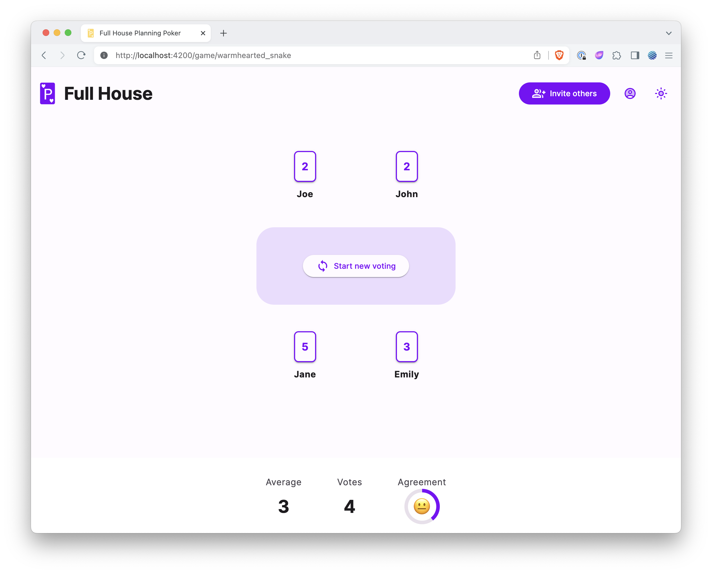
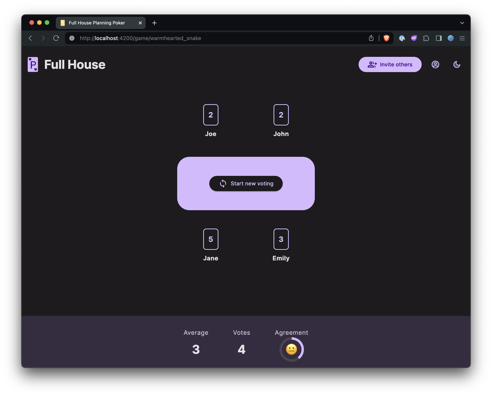

# Full House

[](https://github.com/philmtd/full-house/actions/workflows/build.yml)
[](https://hub.docker.com/r/philmtd/full-house/tags)

This is a simple software implementation of a [Planning Poker](https://en.wikipedia.org/wiki/Planning_poker) game,
mostly used in agile software development.

Players can join a game while e.g. being in a refinement meeting and use this game to estimate the issues discussed in the meeting.

## Run with Docker

Full House can be easily run with Docker:

```bash
docker run -p 8080:8080 philmtd/full-house
```

## Install in Kubernetes with Helm

The [Full House Helm chart](https://artifacthub.io/packages/helm/philmtd/full-house) is available in the following chart repo:

```bash
helm repo add philmtd https://philmtd.github.io/helm-charts
```

## Configuration

Full House runs perfectly fine with the default configuration.

### Customising voting schemes
It is possible to adjust the available voting schemes from which the users can choose when creating a new game. 
Per default, there are the following two schemes available:

```yaml
fullHouse:
  votingSchemes:
    - name: Fibonacci
      scheme: [0, 1, 2, 3, 5, 8, 13, 21, 34, 55, 89]
      includesQuestionmark: true
    - name: Extended Fibonacci
      scheme: [0, 0.25, 0.5, 1, 2, 3, 5, 8, 13, 21, 34, 55, 89]
      includesQuestionmark: true
```

If you want your own custom voting schemes you need to place your configuration in a `fullhouse.yaml` in the `config` sub-directory
of the Full House installation directory.

Each scheme needs a name, the numbers available to vote (need to be 0 or greater, can be floating point numbers) and you can define whether
to include a questionmark `?` voting card or not. If you use a custom config, the defaults will be overwritten, so if you want to include the default
 schemes, just copy them into your configuration.

### Persistent games

It is possible to configure games which will be persistent. This will allow you e.g. to keep the link to a game
as a bookmark or on an intranet page. Whenever you open a link to a persistent game you will directly join the game,
and it will be created under the hood if necessary. The game's settings are stored in the configuration file.

Per default, there are no persistent games. If you wish to create one, you can configure them like this:
```yaml
fullHouse:
  persistentGames:
    - name: My Persistent Game
      slug: persistent_game
      votingSchemeName: Fibonacci
```

This will create a game that will be available under `<FULL_HOUSE_HOSTNAME>/game/persistent_game` with the Fibonacci voting scheme
and with the name "My Persistent Game". The voting scheme name needs to be the name of one of the voting schemes of your
Full House instance.

## Persistence

Full House does not persist any data. All the state is kept in memory.

This has some theoretical downsides:

* Restarting the application will wipe all currently running games and the players will have to create a new game.
* As memory is unique to the application, Full House cannot be scaled horizontally.

Practically these should not appear as problems at the scale this app is intended for.

## Screenshots

The UI has light and dark modes:

| Voting                                           | Results                                            |
|--------------------------------------------------|----------------------------------------------------|
|  |  |
|   |    |

## Development

To build the project you need the following tools installed:

* Go
* [Mage](https://magefile.org/)
* NodeJS / npm

### Build locally

To build the app, you need to build the frontend and the backend.

The backend can be built with mage:

```bash
go mod download # if not done yet
mage build
```

This command will build the application for the system you're running the build on. If you need to cross-compile it for another
system, you'll need to change the parameters passed to the Go compiler in the [magefile](./magefiles/magefile.go).

The build the frontend you need to use `npm` in the `frontend` directory:

```bash
npm install # if not done yet
npm run build
```

### Running the built application

The application expects the following directory structure:

```
full-house # the compiled application
config/ # config directory
├─ fullhouse-default.yaml # default configuration
├─ fullhouse.yaml # optional
frontend/ # the compiled frontend (contents from the dist directory)
├─ ...
```

Given this structure, you can run Full House:

```bash
./full-house server
```

### Build for Docker

Build the frontend as described above. Then run:

```bash
mage buildForDocker
```

This will compile the project and build the Docker image `philmtd/full-house`.

### Running for development

You can start the frontend development server in the frontend directory with

```yaml
npm start
```

The frontend will be available on port `4200`.

To run the backend, run the `fullhouse/cmd/fullhouse` package with the `server` argument:

```yaml
go run fullhouse/cmd/fullhouse server 
```

This can of course be configured as a run configuration in your favorite IDE.