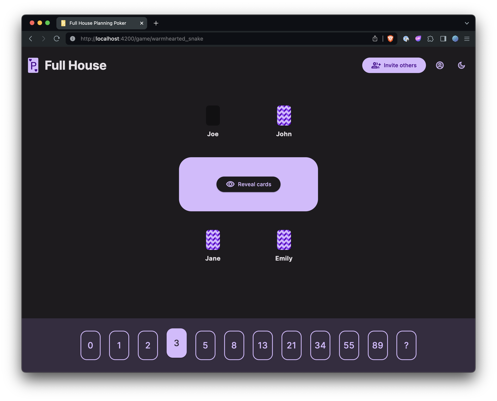

# Full House

[](https://circleci.com/gh/philmtd/full-house/tree/master)
[](https://hub.docker.com/r/philmtd/full-house/tags)

This is a simple software implementation of a [Planning Poker](https://en.wikipedia.org/wiki/Planning_poker) game,
mostly used in agile software development.

Players can join a game while e.g. being in a refinement meeting and use this game to estimate the issues discussed in the meeting.

## Run with Docker

Full House can be easily run with Docker: 
```bash
docker run -p 8080:8080 philmtd/full-house
```

## Configuration

No configuration is required to run Full House.

## Persistence

Full House is a super simple application: It does not persist any data. All the state is kept in memory.

This has some theoretical downsides:
* Restarting the application will wipe all currently running games and the players will have to create a new game.
* As memory is unique to the application, Full House cannot be scaled horizontally.

Practically you'll probably not be confronted with these minor inconveniences.

## Screenshots

The UI has automatic configurable dark/light modes. 

| Voting (Dark Mode)                             | Results (Dark Mode)                              | Voting (Light Mode)                              |
|------------------------------------------------|--------------------------------------------------|--------------------------------------------------|
|  |  |  |
